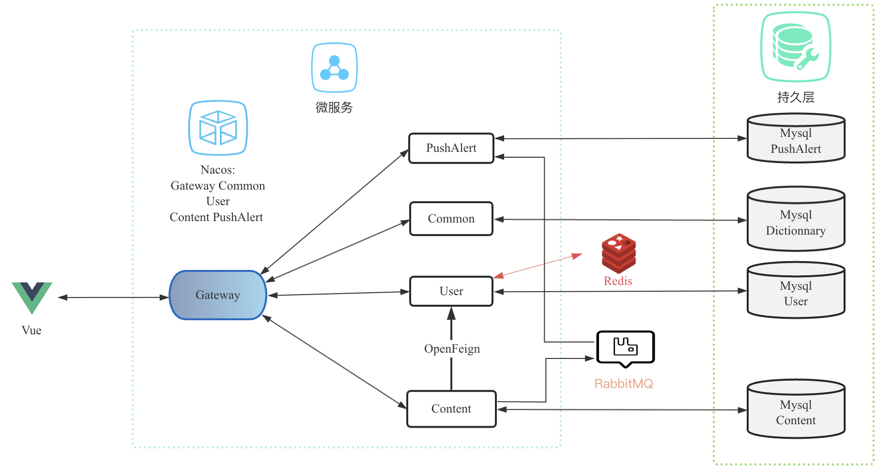

# AniDevEngine

<h3 align="center">
  欢迎来到AniDev，一个开发者的论坛
</h3>

</img>
</img>
</img>
</img>
</img>
</img>
</img>

# 项目介绍

本项目是一位研二的在校学生，学习后端时搭建的论坛。建立这个论坛的初心是想将自己所学的知识运用在实际的项目中。 目前还在开发中。本项目仅仅为了学习使用非商业型项目。

项目采用微服务架构，使用SpringCloud构建，后端技术栈包括SSM、Mybatis-Plus、RabbitMQ、Redis，数据库使用MySQL；前端使用Vue3+ElementUi-Plus搭建论坛页面，Javascript 和Axios实现业务逻辑，使用CKEditor5作为文本编辑 。

主要实现了用户登录注册、文章发布、编辑、管理和评论等功能；支持用户修改个人信息；使用RabbitMQ实现发布/订阅功能；采用Redis缓存技术对一些常用数据进行缓存，例如热门帖子列表和用户个人信息，以提高数据访问速度和系统响应性能。前端使用Vue3+ElementUi-Plus进行界面设计和交互。

# 项目内容

* 实现基本的用户登录注册功能   
* 提供修改个人信息的界面，用户可以更新个人资料，包括昵称、邮箱、密码等
* 实现文章的发布、编辑和管理功能
* 采用Redis缓存技术对一些常用数据进行缓存，以提高数据访问速度和系统响应性能。
* 发布/订阅：发送推送通知或者更新帖子列表 
* 异步任务：异步地处理评论的存储、通知和其他相关操作 
* 社区管理工具：提供管理员使用的工具和界面，用于管理用户、审查帖子、处理投诉和举报等。
* 搜索引擎优化:  优化网站的结构和内容，使其能够被搜索引擎有效地索引和排名
* 数据分析和智能推荐：利用机器学习和数据分析技术，对用户的行为和偏好进行分析，提供个性化的内容推荐和智能匹配功能。 ❌

# 技术选型

后端：SSM、Mybatis-Plus、SpringAMQP、Elasticsearch、Redis、MySQL

前端：Vue3、Vuex、ElementUi-Plus、Axios、CKEditor5

# 系统架构

# 主页面

# 说明

正在开发中，2023年5月29号。
